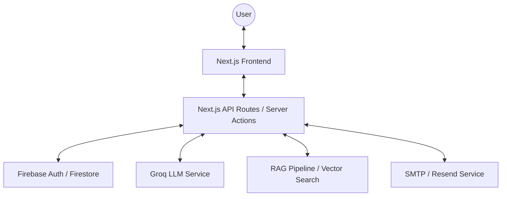

# 📐 Technical Design Document - OnlyAI HR Assistant

This document outlines the technical architecture, data models, and component design for the OnlyAI HR Assistant, based on the [PRD](file:///c:/Software/OnlyAI_HRAssistant/prd.md).

---

## 🏗️ 1. System Architecture

The system follows a **Full-Stack Next.js (App Router)** architecture, leveraging Firebase for infrastructure and Groq for AI intelligence.

---

## 🗄️ 2. Data Model (Firestore)

### `users` (Collection)
Stores employee profile and context.
- `uid`: string (Primary Key)
- `email`: string
- `displayName`: string
- `role`: "employee" | "admin"
- `leaveBalance`: number
- `tenureMonths`: number

### `leave_requests` (Collection)
Tracking all requests and their status.
- `id`: string
- `userId`: string
- `startDate`: timestamp
- `endDate`: timestamp
- `type`: "annual" | "sick" | "unpaid"
- `status`: "approved" | "rejected" | "review"
- `reason`: string (AI generated explanation)
- `createdAt`: timestamp

### `policy_embeddings` (Collection / Vector Store)
Stores chunked HR policies for RAG.
- `id`: string
- `content`: string
- `embedding`: array[number]
- `metadata`: { category, page, source }

---

## 🧠 3. Component Design

### 3.1 Decision Engine (Deterministic)
The core logic that ensures the AI doesn't make arbitrary decisions.
- **Inputs**: `userId`, `requestedDays`, `policyConstraints`.
- **Outputs**: `status` (Approved/Rejected), `explanation`.
- **Rule Example**: `if (requestedDays > user.leaveBalance) return REJECTED`.

### 3.2 RAG Pipeline (Knowledge Retrieval)
Handles natural language queries about HR policies.
1. **Query**: User asks "How much sick leave do I get?"
2. **Retrieve**: Find top-k relevant policy chunks using vector search.
3. **Augment**: Pass chunks + user context to Groq.
4. **Generate**: Return grounded, natural language response.

### 3.3 Premium UI / UX
- **Dashboard**: High-level view of leave stats using glassmorphism.
- **Chat Widget**: Persistent, floating chat interface with Framer Motion animations.
- **Email Preview**: Interactive modal where users can edit AI-generated drafts.

---

## 🔄 4. Primary Data Flow

1. **Auth**: User logs in via Firebase Auth.
2. **Query**: User interacts with the Chat Widget.
3. **Intent Detection**: System determines if the user is *asking a question* or *requesting leave*.
4. **Processing**:
    - **Question**: RAG Service retrieves data and responds.
    - **Leave**: Decision Engine validates request → LLM drafts email.
5. **Action**: User confirms → Firestore updated → Email sent → Log recorded.

---

## 🛡️ 5. Security & Compliance

- **Authentication**: Firebase Auth (JWT) for all API routes.
- **Authorization**: Firestore Security Rules to prevent users from reading others' leave data.
- **Guardrails**: LLM is strictly forbidden from modifying Firestore directly; all writes must pass through the `DecisionEngine`.
- **Audit Logs**: Every AI response and user action is stored in a `logs` collection for HR audit.

---

## 🚀 6. Deployment Strategy

- **Hosting**: Vercel or Firebase Hosting (SSG/SSR).
- **Environment**: Managed via `.env.local`.
- **CI/CD**: Automated deployment on push to `main`.
